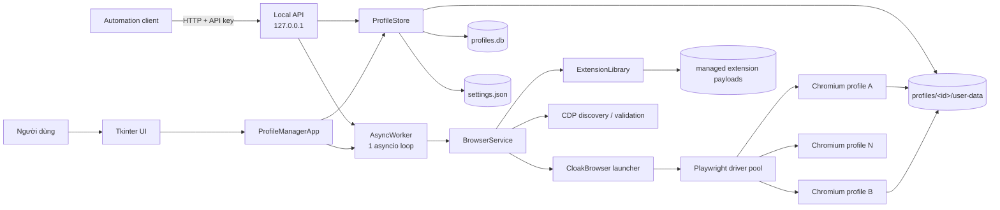
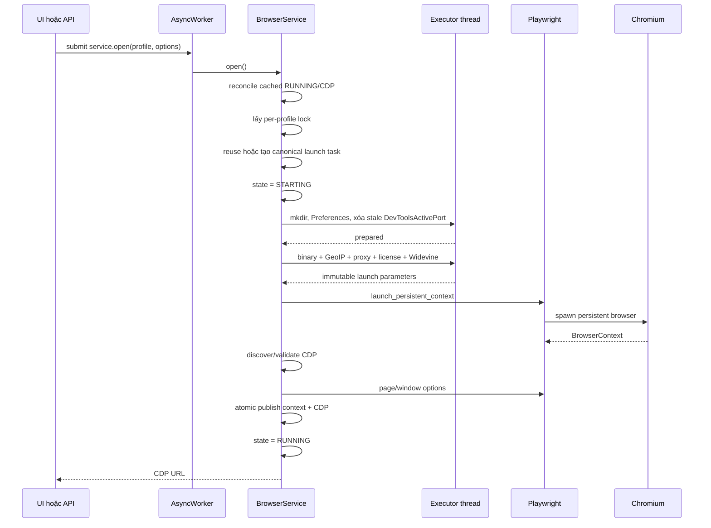
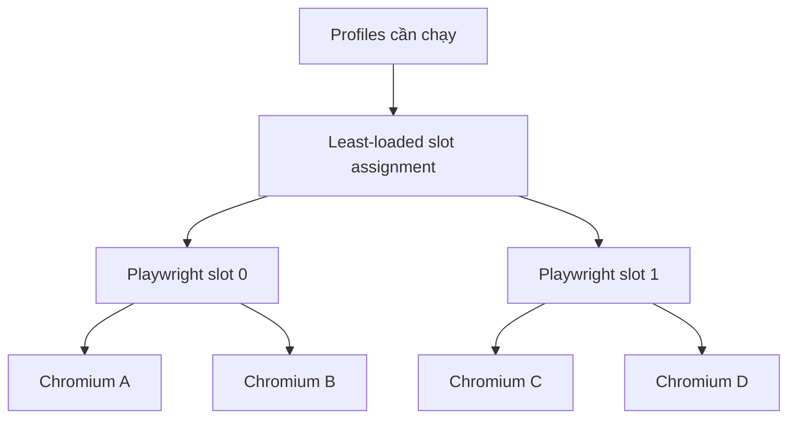
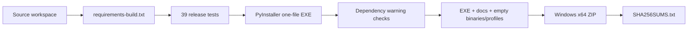

# Kiến trúc CloakBrowser Profile Manager

> Tài liệu này mô tả **source hiện tại** của ứng dụng desktop và bản release `v0.3.5`. Đây không phải kiến trúc mục tiêu trong tương lai.

## 1. Bức tranh tổng thể

Ứng dụng là một **desktop local-agent** chạy trên Windows:

- Tkinter cung cấp giao diện quản lý profile.
- `ThreadingHTTPServer` cung cấp API loopback cho automation bên ngoài.
- Một thread riêng sở hữu một asyncio event loop và toàn bộ Playwright async objects.
- Mỗi profile mở thành một Chromium persistent context với thư mục dữ liệu riêng.
- Metadata được lưu trong SQLite; cookie, cache và browser state nằm trong Chromium user-data directory.



## 2. Thành phần và trách nhiệm

| Thành phần | Trách nhiệm |
|---|---|
| `main.py` | Bootstrap source/frozen mode, nạp `.env`, cấu hình binary cache, xử lý `--install-browser`, khởi động Tk main loop. |
| `profile_manager/app.py` | Composition root: tạo store, worker, browser service, API và UI; điều phối thao tác và shutdown. |
| `profile_manager/ui.py`, `profile_manager/views/` | Widget, dialog, page và phản hồi giao diện. Không trực tiếp sở hữu browser. |
| `profile_manager/profile_store.py` | Profile metadata trong SQLite, settings JSON, migration và profile directories. |
| `profile_manager/worker.py` | Một daemon thread tên `browser-worker` sở hữu một asyncio event loop. |
| `profile_manager/browser_service.py` | Nguồn sự thật runtime cho context, state, CDP URL, generation, Playwright pool và lifecycle. |
| `profile_manager/devtools.py` | Khám phá `DevToolsActivePort`; kiểm tra `/json/version` và cached CDP endpoint. |
| `profile_manager/api_server.py` | HTTP API local, authentication, CRUD, health, diagnostics, preflight và lifecycle operations. |
| `profile_manager/operations.py` | Trạng thái in-memory của operation open/close do API tạo. |
| `profile_manager/extensions.py` | Import, content-addressed storage và assignment extension theo profile. |
| `profile_manager/proxy.py` | Validate/normalize proxy và che credential trong UI/lỗi. |
| `cloakbrowser/cloakbrowser/browser.py` | Chuẩn bị binary/proxy/GeoIP/license/Widevine/flags và gọi Playwright launch. |

## 3. Execution model và ownership

### 3.1 Các thread/process

| Execution owner | Công việc |
|---|---|
| Tk main thread | Toàn bộ widget và UI state. |
| `browser-worker` | Asyncio loop, `BrowserService`, Playwright async API và context callbacks. |
| API server thread | Chạy `serve_forever()`. |
| HTTP request threads | Mỗi request của `ThreadingHTTPServer`; đọc store/operation hoặc submit coroutine. |
| Default executor threads | Blocking preparation qua `asyncio.to_thread()`: binary, GeoIP, filesystem, diagnostics và extension operations. |
| Playwright driver processes | Điều khiển Chromium; được chia sẻ theo pool cấu hình. |
| Chromium processes | Browser persistent riêng cho từng profile đang mở. |

### 3.2 Quy tắc ownership quan trọng

1. **Playwright async objects chỉ được dùng trên worker loop.** Không chuyển context/page/session sang HTTP hoặc Tk threads.
2. Blocking preparation được đưa qua `asyncio.to_thread()`; không khóa event loop chung.
3. UI callback từ worker được chuyển về Tk thread bằng `root.after(...)`.
4. API request không chạy browser trực tiếp; nó submit coroutine qua `AsyncWorker`.

### 3.3 Synchronization

- `BrowserService._locks[profile_id]`: serialize lifecycle của cùng profile.
- `_launch_tasks`: một canonical launch task cho mỗi profile; nhiều caller cùng chờ một task.
- `_launch_slots = asyncio.Semaphore(1)`: launch browser toàn cục hiện được tuần tự hóa.
- `_playwright_locks[slot]`: bảo vệ lazy start/stop từng Playwright instance.
- `_generation`: ngăn callback context cũ xóa runtime của browser vừa mở lại.
- `_snapshot_lock`: snapshot nhất quán cho state và CDP URL giữa worker/API threads.
- `AsyncWorker._state_lock`: serialize submit với shutdown; coroutine bị từ chối được đóng.
- SQLite mở connection theo operation, dùng WAL, foreign keys và busy timeout.

## 4. Luồng mở browser



### Các bước chính

1. `open()` gọi reconciliation nếu runtime đang cho rằng profile là `RUNNING`.
2. Cached CDP được kiểm tra off-loop. Nếu chết, state cũ chỉ bị xóa khi generation, context và URL vẫn khớp snapshot.
3. Nếu browser vẫn khỏe, service áp lại geometry cần thiết và trả URL hiện tại.
4. Nếu cần launch, service tạo đúng một `_launch_task`; caller dùng `asyncio.shield()` để cancellation của một caller không hủy launch dùng chung.
5. Filesystem preparation và CloakBrowser synchronous preparation chạy trong executor thread.
6. Playwright protocol call chạy trên worker loop, có tổng timeout `LAUNCH_TIMEOUT = 60s`.
7. `DevToolsActivePort` phải mới hơn thời điểm launch; `/json/version` phải trả WebSocket endpoint đúng port.
8. Context và CDP URL chỉ được publish khi toàn bộ launch thành công.

### Browser identity

Mỗi profile có:

- fingerprint seed bền vững;
- user-data directory riêng;
- proxy/GeoIP/timezone/locale riêng;
- optional extensions và humanization;
- dynamic CDP port chỉ bind `127.0.0.1`.

## 5. Luồng đóng và crash

### Close chủ động

1. `close(profile_id)` lấy per-profile lock.
2. Nếu launch đang chạy, tăng generation và cancel canonical launch task.
3. Chờ launch cleanup hoàn tất.
4. Gọi `context.close()` với `CLOSE_TIMEOUT = 15s`.
5. Dọn context, CDP URL, Playwright slot assignment và chuyển `STOPPED`.
6. Nếu close timeout, profile chuyển `ERROR` và caller nhận lỗi.

### Browser đóng/crash ngoài ứng dụng

Khi context phát event `close`, `_handle_context_closed()`:

- lấy per-profile lock;
- so sánh generation và object identity;
- bỏ qua callback stale;
- dọn runtime và chuyển `STOPPED`.

Nếu event chưa đến nhưng cached CDP đã chết, lần `open()` kế tiếp sẽ reconcile rồi relaunch.

## 6. Playwright pool

`playwright_instances` trong settings nằm trong khoảng `1–20`.

- Profile mới được gán vào slot có ít assignment nhất.
- Nhiều browser contexts có thể dùng chung một Playwright driver.
- Pool giảm overhead so với một driver cho mỗi profile.
- Đây **không phải** hard limit số browser.
- Launch hiện vẫn serialize bằng semaphore 1 để giảm contention lúc startup.



## 7. API và operation model

API chỉ bind `127.0.0.1` và dùng API key.

Open/close dùng response đồng bộ:

1. HTTP request thread submit coroutine vào worker.
2. Request thread chờ `concurrent.futures.Future` với deadline lớn hơn timeout nội bộ.
3. Worker thực hiện lifecycle trên asyncio loop duy nhất.
4. Open trả trực tiếp CDP HTTP/WebSocket endpoint; close trả trạng thái `stopped`.
5. Status chỉ đọc snapshot cache trên worker loop, không probe hoặc launch browser.

Mỗi HTTP request có thread riêng nên một launch không khóa API server. Timeout thực sự nằm trong `BrowserService`; timeout ở HTTP thread chỉ là safety margin.

## 8. Persistence

```text
.profile-manager/
├── profiles.db
├── settings.json
└── extensions/
    ├── payloads/{digest}/
    ├── .staging/
    └── .trash/

profiles/{profile-id}/
├── profile.json
└── user-data/
    ├── Default/Preferences
    ├── DevToolsActivePort   # chỉ khi browser chạy
    └── ... Chromium state
```

### Durable

- SQLite: profile metadata và extension assignments.
- `settings.json`: API host/port/key, profile root và Playwright pool size.
- `profile.json`: metadata phụ cạnh profile.
- `user-data`: cookies, cache, local storage, history và Chromium preferences.
- Extension payloads: lưu content-addressed để tránh duplicate.

### Ephemeral

- Browser contexts, CDP URLs và runtime states.
- Launch tasks, locks, generation và slot assignments.
- API operation history.

Sau process restart, ứng dụng không attach lại browser cũ; runtime mặc định trở về `STOPPED`.

## 9. Reliability và failure boundaries hiện có

| Failure | Cơ chế hiện tại |
|---|---|
| Blocking binary/GeoIP/filesystem work | `asyncio.to_thread()`, không block worker loop. |
| Launch treo | Timeout 60 giây, cancellation-safe cleanup. |
| Close treo | Timeout 15 giây, state `ERROR`. |
| Playwright stop treo | Timeout 15 giây. |
| Nhiều open cùng profile | Canonical launch task. |
| Close trong lúc launch | Cancel launch task và cleanup. |
| Stale context callback | Generation + identity check. |
| Cached CDP chết | Probe off-loop và conditional reconciliation trước reuse. |
| Worker submit/shutdown race | Lock-protected stopping state; rejected coroutine được đóng. |
| Worker không dừng | `stop()` raise timeout thay vì báo thành công giả. |
| Proxy credential trong launch error | Redaction trước khi publish. |
| Partial settings/preferences write | Temp file + atomic replace. |
| Extension import/delete lỗi | Staging/trash và rollback. |
| SQLite contention | WAL + busy timeout. |

## 10. Startup và shutdown

### Startup

1. Xác định project root cạnh source hoặc EXE.
2. Nạp `.env` và đặt binary cache mặc định vào `binaries/`.
3. Khởi tạo store/migrations.
4. Khởi động worker thread.
5. Tạo extension library và browser service.
6. Bind/start local API.
7. Dựng UI và vào Tk main loop.

### Shutdown

1. UI chuyển sang shutting-down và service bắt đầu draining.
2. API server dừng nhận request.
3. `close_all()` cancel launch và đóng các profile đã biết.
4. Shared Playwright instances được stop có timeout.
5. Worker loop dừng và Tk root bị destroy.

## 11. Build và release



- Entry point: `main.py`.
- PyInstaller tạo windowed one-file EXE.
- Local CloakBrowser source được dùng trong build hiện tại.
- `geoip2.database`, `maxminddb` và `socksio` được explicit hidden-import.
- Build dừng nếu production dependencies thiếu hoặc PyInstaller báo không bundle chúng.
- Chromium binary không nằm trong ZIP; `Install-Browser.cmd` gọi EXE với `--install-browser` để tải vào `binaries/`.

## 12. Những gì kiến trúc hiện tại chưa làm

Đây là các giới hạn có chủ ý hoặc chưa được triển khai:

1. Không có process-per-profile supervisor hoặc Windows Job Object.
2. Không persist PID/process handle và không attach lại Chromium sau app restart.
3. Không có periodic health polling; CDP reconciliation hiện chạy khi tái `open()`.
4. Close timeout chưa có fallback `terminate -> kill` bằng process handle.
5. Shared Playwright slot chưa tự restart khi driver process chết.
6. API chưa trả browser PID vì Playwright persistent context không expose process handle công khai.
7. Readiness hiện chưa chứng minh event-loop responsiveness bằng heartbeat có deadline.
8. Proxy credential và API key đang lưu plain text local.
9. Release chưa code-sign và không có installer/auto-update.

## 13. Định hướng nâng cấp khi có bằng chứng vận hành

Ưu tiên theo chi phí thấp đến cao:

1. Worker heartbeat cho readiness.
2. Playwright slot restart khi driver transport chết.
3. Invalidate/restart Playwright slot khi transport chết.
4. Theo dõi process handle để close timeout có terminate/kill fallback.
5. Chỉ chuyển sang process-per-profile khi telemetry chứng minh shared worker/driver vẫn tạo blast radius không chấp nhận được.

Không cần checkpointing, distributed queue hoặc orchestration service cho mô hình desktop local hiện tại.
